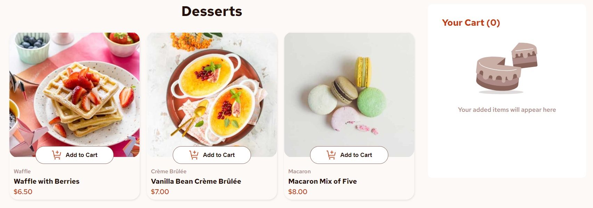

# Frontend Mentor - Product list with cart solution

This is a solution to the [Product list with cart challenge on Frontend Mentor](https://www.frontendmentor.io/challenges/product-list-with-cart-5MmqLVAp_d). Frontend Mentor challenges help you improve your coding skills by building realistic projects. 

## Table of contents

- [Overview](#overview)
  - [The challenge](#the-challenge)
  - [Screenshot](#screenshot)
  - [Links](#links)
- [My process](#my-process)
  - [Built with](#built-with)
  - [What I learned](#what-i-learned)
  - [Continued development](#continued-development)
  - [Useful resources](#useful-resources)
- [Author](#author)
- [Acknowledgments](#acknowledgments)

## Overview

### The challenge

Users should be able to:

- Add items to the cart and remove them
- Increase/decrease the number of items in the cart
- See an order confirmation modal when they click "Confirm Order"
- Reset their selections when they click "Start New Order"
- View the optimal layout for the interface depending on their device's screen size
- See hover and focus states for all interactive elements on the page

### Screenshot

### Links

- Solution URL: [GitHub](https://github.com/polinagusakova/Product-list)
- Live Site URL: [GitHub pages](https://polinagusakova.github.io/Product-list/)

## My process

### Built with

- Flexbox
- Grid
- JavaScript
- React
- Styled components

### What I learned

I learned how to create React app. How to use React logic. Also grid layout and how to place on the page several items from JSON file.

**Note: Delete this note and the content within this section and replace with your own learnings.**

### Continued development

I want to continue practicing with responsible design and accessibility. How to create React apps and work in.

### Useful resources

- [MDN resources](https://developer.mozilla.org/en-US/) - This helped me for searching information and to found answers.
- [Stack Overflow](https://stackoverflow.com/) - This helped me to resolve problem with JS events.
- [W3Schools](https://www.w3schools.com/) - Learn to code.
- [React](https://react.dev/) - The library for web and native user interfaces.

## Author

- Website - [Polina](https://github.com/polinagusakova)
